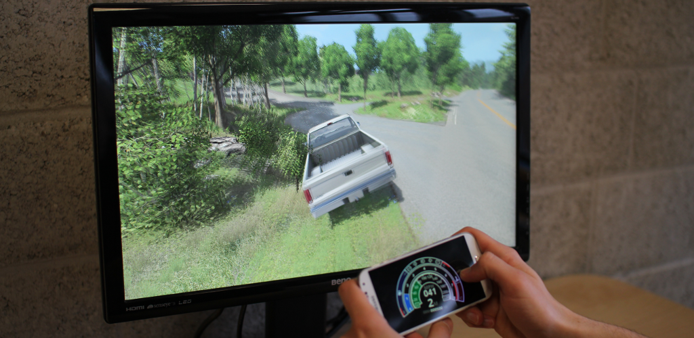

BeamNG.drive Remote Control
===========================

Remote Control app for the PC game [BeamNG.drive](http://beamng.com/).

### Communication functionality ###

*   App sends out a broadcast in its local wifi on port 4444. It sends the string "beamng" + device-name.
*   It then listens on the same Port for the string "beamng" as an answer to start the communication.
*   Main communication takes place on port 4445
*   App sends the floats:
    * Steering-angle between 0 (right) and 1 (left)
    * Throttle 1 for pushed otherwise 0
    * Breaks 1 for pushed otherwise 0
*   App needs following structure for incoming packages:  

type              | name          | description                                      | bytes  
----------------- | ------------- | ------------------------------------------------ | -------------
unsigned          | time          | time in milliseconds (to check order)            | 0-3  
char              | car[4]        | Car name                                         | 4-7  
unsigned short    | flags         | Info (see OG_x below)                            | 8-9  
char              | gear          | Reverse:0, Neutral:1, First:2...                 | 10  
char              | plid          | Unique ID of viewed player (0 = none)            | 11  
float             | speed         | m/s                                              | 12-15  
float             | rpm           | RPM                                              | 16-19  
float             | turbo         | BAR                                              | 20-23  
float             | engTemp       | C                                                | 24-27  
float             | fuel          | 0 to 1                                           | 28-31  
float             | oilPressure   | BAR                                              | 32-35  
float             | oilTemp       | C                                                | 36-39  
unsigned          | dashLights    | not used                                         | 40-43
unsigned          | showLights    | Dash lights currently switched on                | 44-47  
float             | throttle      | 0 to 1                                           | 48-51  
float             | brake         | 0 to 1                                           | 52-55  
float             | clutch        | 0 to 1                                           | 56-59  
char              | display1[16]  | Usually Fuel                                     | 60-75  
char              | display2[16]  | Usually Settings                                 | 76-80  
int               | id            | optional - only if OutGauge ID is specified      | 81-84  
unsigned          | odometer	  | distance driven in meters or miles (0-999999)    | 85-88  

    // OG _x - bits for Flags  
    OG_KM         16384    // if not set - user prefers MILES  

    // DL _x - bits for ShowLights  
    DLSHIFT,           // bit 0    - shift light  
    DLFULLBEAM,        // bit 1    - full beam  
    DLHANDBRAKE,       // bit 2    - handbrake  
    DLPITSPEED,        // bit 3    - pit speed limiter                            //not used  
    DLTC,              // bit 4    - TC active or switched off                    //not used  
    DLSIGNALL,         // bit 5    - left turn signal  
    DLSIGNALR,         // bit 6    - right turn signal  
    DLSIGNALANY,       // bit 7    - shared turn signal  
    DLOILWARN,         // bit 8    - oil pressure warning                         //not used  
    DLBATTERY,         // bit 9    - battery warning                              //not used  
    DLABS,             // bit 10   - ABS active or switched off  
    DLSPARE,           // bit 11                                                  //not used  
